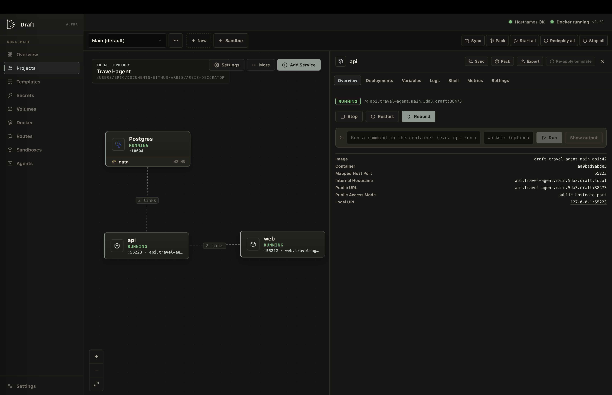

# Draft

**A calmer control surface for local multi-service Docker.**

Draft is a native desktop app that turns your stack into a visual workspace: projects on a canvas, one-click templates, stable hostnames, env wiring that doesn’t break, durable environments for day-to-day work, and short-lived sandboxes for PR previews and test recipes.

> **Status:** alpha — useful day-to-day, still evolving.

<p align="center">
  
</p>

<p align="center"><em>One project, one canvas: services linked by env references, stable public URLs, and an environment switcher for Main / feature / staging copies of the same stack.</em></p>

---

## Why Draft

Local Docker is powerful and noisy. Ports collide. `localhost:3847` means nothing next week. Wiring `DATABASE_URL` means copy-paste across Compose files. Keeping a feature branch stack alive means hand-editing Compose, juggling ports, and rebuilding by muscle memory.

Draft keeps Docker, and removes the busywork:

| Instead of… | Draft gives you… |
|-------------|------------------|
| Random host ports | Stable dual hostnames (`*.draft.local` + `*.draft.resolv.sh`) |
| Hardcoded service URLs | `@{postgres.DRAFT_INTERNAL_URL}` references |
| One fragile Compose file | **Multiple environments** of the same configuration — branches stay clean |
| Manual `docker compose up` after every commit | Pin a branch per service → **redeploy automatically on commit** |
| Digging through `git log` + rebuild scripts | Redeploy any service from a **commit SHA** in one step |
| Manual PR stack copies | Sandboxes with TTL, branch/PR pins, and test recipes |
| Hunting containers in Docker Desktop | Canvas topology, logs, shell, metrics, and a Routes directory |

---

## Quick start

1. **Install & run Docker** (Docker Desktop or a local daemon).
2. **Open Draft** → create a project (name + local folder).
3. **Add Service** → pick templates (e.g. **PostgreSQL** + **Next.js**).
4. **Deploy** from the service drawer — image-mode datastores often auto-start after create.
5. Open the **public URL** Draft assigned. Wire the app with:

```bash
DATABASE_URL=@{postgres.DRAFT_INTERNAL_URL}
```

That’s the loop: shape topology on the canvas, deploy, reference services by name, ship.

When you need a second copy of the stack — a feature branch, a staging clone — create another **environment**, pin each service to a branch, and turn on **redeploy on commit**. Draft owns the rebuilds; your branches stay isolated.

---

## Mental model

```text
Project
 └── Environments          (durable: default, staging, …)
      └── Services         (canvas nodes — build, image, or git-sourced)
 └── Sandboxes             (short-lived environment copies)
```

- Every project starts with a **default environment**. The canvas is per-environment.
- Environment **slugs** are immutable — they’re baked into hostnames, networks, images, and volumes.
- **Sandboxes** are normal environments plus lifecycle (TTL → warning → expire → purge), with a fixed `sand` hostname label so they never collide with durable envs.

---

## What you can do

### Visual workspace

- Drag services on a canvas with status pills, volume chips, and env-reference edges.
- Service drawer: **Overview · Deployments · Variables · Logs · Shell · Metrics · Settings**.
- Workspace views: Overview, Projects, Templates, Secrets, Volumes, Docker, Routes, Sandboxes, Settings — plus **Agents** for driving Draft from coding CLIs via MCP.

### Templates that stamp a real service

Built-ins across **Web · Language · Datastore · Tooling · Image**, including Next.js, Node, Go, Rust, Deno, FastAPI, Flask, Vite, Express, Django, Rails, Phoenix, .NET, Spring Boot, Static Site, PostgreSQL, Redis, MySQL, MongoDB, MinIO, RabbitMQ, Meilisearch, Memcached, ClickHouse, Mailpit, Adminer, and **Prebuilt Image**.

Clone a built-in or create your own. Templates stamp settings, env defaults, volumes, and optional Dockerfiles — including `{{draft.*}}` expressions resolved at create time.

### Stable identity & networking

```text
Normal:   {service}.{project}.{environment}.{uid}.draft.local
Public:   … .draft.resolv.sh
Sandbox:  {service}.{project}.sand.{environment}.{uid}.draft.local

Example:  api.myapp.default.a3f2.draft.local
          web.myapp.sand.pr-412.b7c1.draft.local
```

- HTTP services go through Draft’s reverse proxy (prefer port 80, with a stable fallback).
- TCP services (databases) get a stable `host:port` without an HTTP scheme.
- Optional machine-local `*.draft` DNS from Settings (separate from Docker’s `*.draft.local`).

Draft injects runtime identity into every container: `DRAFT_SERVICE_PORT`, `DRAFT_INTERNAL_HOSTNAME` / `URL`, `DRAFT_PUBLIC_HOSTNAME` / `URL`, `DRAFT_SERVICE_NAME`, `DRAFT_PROJECT_NAME`, `DRAFT_ENVIRONMENT`.

### Env wiring that stays readable

| Syntax | Meaning |
|--------|---------|
| `@{Service.ATTR}` | Cross-service reference (hostnames, URLs, ports, peer env keys) |
| `{{project.KEY}}` | Project shared values |
| `{{secret.KEY}}` | App-wide secrets |
| `{{draft.*}}` | Template identity expressions (stamp time) |

Import / export / refresh `.env` files. Most edits are **staged** until the next successful deploy; git branch, deploy trigger, service root, and env-file path apply immediately.

### Environments & git — stop babysitting Docker

This is the loop Draft is built around: **same stack, many environments, branches pinned, deploys on autopilot.**

1. **Create environments** — blank, or **duplicate based on** another (`Fresh` · `Share` · `Clone`). Each env is a full copy of the project’s services with its own hostnames, network, and volumes. Your feature branch doesn’t pollute `main`; your staging clone doesn’t fight your laptop’s day-to-day stack.
2. **Pin a branch (or ref) per service** — set `git_branch` in Settings. Draft builds from that committed tree, not whatever happens to be dirty in your working directory.
3. **Redeploy on commit** — set the deploy trigger to `on_commit` (or `on_push`). Local git hooks wake Draft; the service rebuilds and restarts. No Compose file to keep in sync, no “did I remember to rebuild?” — containers track the branch.
4. **Redeploy from any commit** — point the pin at a SHA (or use deployment history / rollback) and rebuild that exact tree. Bisect a regression, re-run last week’s tip, or freeze a preview without inventing a one-off script.

Also:

- Optional **redeploy on pull** (merge and rebase) — orthogonal to commit/push triggers.
- **Share** attaches a root container onto another env’s network (one Postgres, many consumers).
- **Linked services** put an alias node in one env that points at a root in another.
- Sync config between environments; start / stop / redeploy the whole stack.

### Sandboxes for previews and tests

- **Preview** — short-lived PR / feature copy → Create & start.
- **Testing** — rebuildable recipe + commands → Create & run; on complete: leave, suspend, or delete.
- Per-service plan: copy · share · omit (with volume data modes).
- Pin source at create to a branch/ref or GitHub PR (via local `gh`) without mutating the durable env.
- Refresh tip or same SHA, extend TTL, suspend/resume. Delete removes containers, routes, the sandbox network, and Draft-managed volumes.

### Share & import

- **Draft packs (`.draftpack`)** — config-only share of a service, environment, or project across machines (optional secrets/binds; content-hash integrity).
- **Cloud config** — import/export Compose, Cloud Run, ECS, Container Apps.

### Operate without leaving the app

Live build logs, container logs, interactive shell, metrics, deployment history + image / SHA rollback, Secrets / Volumes / Routes / Docker admin views.

---

## Workspace tour

| View | Role |
|------|------|
| **Overview** | Dashboard: projects, envs, services, activity |
| **Projects** | Project cards with multi-env rollups; open canvas |
| **Templates** | Built-in + custom service blueprints |
| **Secrets** | App-wide vault → `{{secret.KEY}}` |
| **Volumes** | Draft-managed volumes, orphans, reclaim |
| **Docker** | Full daemon inventory + prune (not just Draft’s) |
| **Routes** | Local ingress directory (HTTP proxied · TCP host ports) |
| **Sandboxes** | Preview/test sandboxes, profiles, test-run history |
| **Settings** | Sidebar, URL presentation, proxy ports, `*.draft` DNS |
| **Agents** | In-app agent CLIs with Draft MCP tools attached |

---

## Architecture

```text
┌─────────────┐   Wails IPC + daemon HTTP/SSE   ┌──────────────────┐
│  Wails App  │ ◄─────────────────────────────► │     Daemon       │
│  (React UI) │                                 │   (--daemon)     │
└─────────────┘                                 └────────┬─────────┘
                                                         │
                              ┌──────────────────────────┼──────────────────────────┐
                              │                          │                          │
                         SQLite store              Deploy engine              Local router
                         (draft.db)                builds / pulls             hostnames / proxy
                                                   logs / metrics             hosts / optional DNS
```

| Mode | How | Role |
|------|-----|------|
| Desktop | default | Wails UI + bindings |
| Daemon | `--daemon` | Deploy, Docker watch, router, SSE, sandbox lifecycle |
| Git hook | `--git-hook` | Wake daemon and fire commit/push/pull triggers |
| MCP | `mcp` / `--mcp` | Stdio MCP server for coding agents |

The daemon is single-instance. It writes `daemon.json` (`addr`, `token`, `pid`) under the OS user config dir (`…/Draft/`), reuses a healthy existing daemon, and idles out after **30 minutes**. State lives in `draft.db` (GORM + pure-Go SQLite).

On daemon start: reconcile Docker, service-link networks, sandbox lifecycle, and missed git triggers. A ticker re-runs sandbox lifecycle every minute. Git hook installation is reconciled when the desktop app starts.

### Tech stack

| Layer | Choice |
|-------|--------|
| Desktop shell | Wails v2 (`v2.12.0`) |
| Backend | Go 1.25 |
| Frontend | React 18 + TypeScript + Vite |
| Canvas | `@xyflow/react` |
| Storage | GORM + `glebarez` / `modernc` SQLite |
| Docker | Docker SDK + optional `docker buildx` |
| Icons | `lucide-react`, `@icons-pack/react-simple-icons` |

---

## How deploy works

Draft picks a path from node settings:

1. **Linked service** — `service_link` set → multi-attach the root container (no second build).
2. **Image mode** — `image` set, `dockerfile` empty → `docker pull` + run.
3. **Build mode** — `dockerfile` + `service_port` → build then run.
4. **Git-sourced build** — same as build, but from a pinned `git_branch` (committed tree only).

Git transport:

- **Stream** (`git_stream` on by default) — `git archive` piped into Docker (fast; ignore / BuildKit local-context do not apply).
- **Checkout** (`git_stream=false`) — export ref to a temp dir; can honor ignore rules and BuildKit local-context.

Shared finish: resolve env (`{{project.*}}` / `{{secret.*}}` / `@{Service.ATTR}`), attach volumes, join the environment network, register HTTP or TCP routes, start the container, **promote staged config on success**, apply image retention (`keep_images`: `last` | `none` | `all`).

Docker naming uses the environment segment (slug, or `sand-{slug}` for sandboxes):

```text
network:   draft-{projectId}-{project}-{envSegment}
image:     draft-{project}-{envSegment}-{service}:{sequence}
container: draft-{project}-{envSegment}-{service}-{sequence}
volume:    draft-{projectId}-{project}-{envSegment}-{uid}-{target}   (label draft.managed=true)
```

### Git triggers

Pin a service to a branch/ref, then let Draft own the rebuild loop:

- `deploy_trigger`: `manual` | `on_commit` | `on_push` (requires pinned `git_branch`).
- `redeploy_on_pull`: independent; installs `post-merge` + `post-rewrite` (merge and rebase pulls).
- Redeploy a historical SHA by pinning that commit (or rolling back to a retained image / rebuild-from-`source_sha`).
- Cold-start: hook payloads spool under `pending-rechecks/` and drain when the daemon boots.
- Hooks install per repo (reference-counted), honor `core.hooksPath` / worktrees, and chain foreign hooks via `.draft-orig`.

### Staged vs immediate config

- **Applied** = live `node_settings` / `env_vars` (what the last successful deploy used).
- **Staged** = pending overrides until the next successful deploy.
- **Immediate** (write applied now): `git_branch`, `deploy_trigger`, `redeploy_on_pull`, `git_stream`, `service_root`, `env_file`.

---

## Agents & MCP

Draft can expose itself to coding agents:

```bash
Draft mcp          # or: Draft --mcp
```

The MCP server talks to the local daemon and offers tools for discovery, services/deploy, environments, sandboxes, volumes, Docker admin, and more. The in-app **Agents** view launches CLIs (Claude, Codex, and others) with Draft MCP attached so agents can operate your local stack.

---

## Development

### Requirements

- Go 1.25+
- Node.js (for the Vite frontend)
- [Wails v2](https://wails.io) CLI
- Docker daemon available locally
- **macOS:** CGO required for Wails/WebKit
- **Windows:** store uses pure-Go SQLite (no CGO for DB)

### Commands

```bash
# Live development (Vite HMR + Wails)
wails dev

# Production package → build/bin
wails build

# Frontend only
cd frontend && npm install && npm run build
```

Daemon helpers:

```bash
./scripts/kill-daemon.sh            # Unix
./scripts/kill-daemon.sh -f         # force
.\scripts\kill-daemon.ps1           # Windows
.\scripts\kill-daemon.ps1 -Force
```

Same binary modes:

```bash
./Draft --daemon
./Draft --git-hook --repo <path> --event <post-commit|pre-push|post-merge|post-rewrite>
./Draft mcp
```

Config / state locations:

| OS | Path |
|----|------|
| Windows | `%AppData%\Draft\` |
| macOS | `~/Library/Application Support/Draft/` |
| Linux | `~/.config/Draft/` (or `$XDG_CONFIG_HOME`) |

Files: `draft.db`, `daemon.json`.

Line endings in-repo are LF (`.gitattributes`); Windows `.ps1` / `.bat` / `.cmd` keep CRLF. Don’t fight Wails-generated `frontend/wailsjs` with CRLF.

Stock Wails template notes live in [`README.wails.md`](./README.wails.md). Want to contribute? See [`CONTRIBUTING.md`](./CONTRIBUTING.md). Deeper product/architecture notes live in [`CLAUDE.md`](./CLAUDE.md).

---

## Current limitations

- Draft does not manage on-disk `git worktree` checkouts for editing; branch deploys use pinned refs (per-service Settings, sandbox create, or durable env duplicate).
- Explicit depends-on edges are not first-class; stack start orders by inferred `@{Service…}` connections.
- Secrets remain plaintext in local SQLite (same class of risk as a local `.env` once the machine is owned).

---

## License

Licensed under the [Apache License, Version 2.0](./LICENSE). See [`NOTICE`](./NOTICE) for copyright attribution.

```
Copyright 2026 Eric Gilerson
```

Draft is under active development (alpha). For day-to-day work on the codebase, start with [`CLAUDE.md`](./CLAUDE.md).
